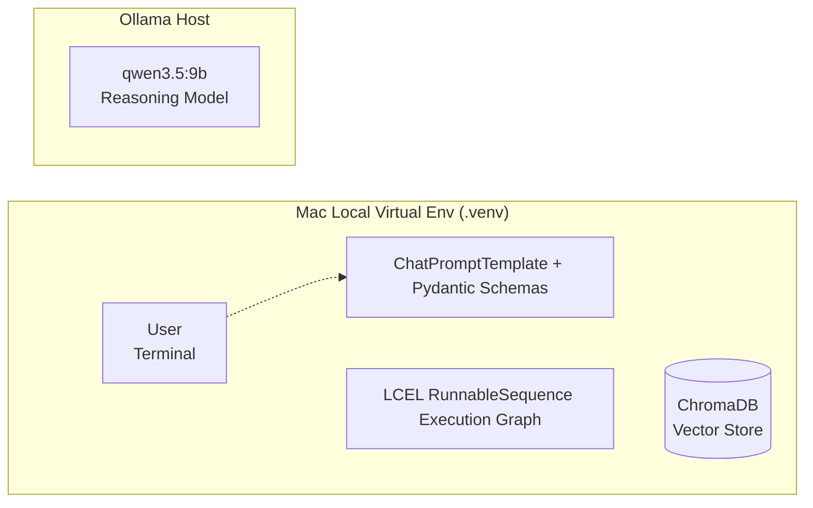
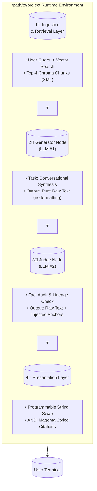

## ---

**📑 langchain-lab**

A progressive, end-to-end lab exploring local Large Language Model (LLM) orchestration patterns using **LangChain Expression Language (LCEL)**, **Ollama**, and **ChromaDB**.


This lab details the engineering transition from a stateless raw HTTP API client into an enterprise-grade, fault-tolerant **Retrieval-Augmented Generation (RAG)** pipeline featuring stateful background memory and decentralized **LLM-As-A-Judge** factual validation nodes.

## ---

**🏗️ Core Laboratory Architecture Overview**

The projects inside this laboratory run completely locally on consumer-grade hardware. By swapping the traditional cloud provider layer for a localized setup at `/path/to/project`, this repository demonstrates how to retain full data privacy, fine-tune hyper-parameters (such as context window ceilings and temperature settings), and eliminate runtime cloud API transaction costs without exposing local environment specifics:

## **Core Laboratory Architecture Overview**





## ---

**🗂️ Lab Program Directory & Flow Mechanics**

## **1_simple_client.py: Stateless Raw Network Bootstrap**

*   **Purpose**: Establishes a raw network baseline using a standard connection pool manager without high-level abstraction frameworks.  
*   **Architecture**: Implements an infinite console chat loop interacting with an OpenAI-compatible web endpoint via httpx.  
*   **Flow**:  
  `[User Prompt Input] ➔ [HTTPX POST Payload Assembly] ➔ [Network Socket] ➔ [Local Server JSON Parse]`

*   **Key Learning**: Demonstrates defensive programming constraints by slicing massive paste operations and catching raw HTTP connection dropouts or processing timeouts cleanly.

## **2_langchain_demo.py: High-Level Abstractions & LCEL Frameworks**

*   **Purpose**: Introduces LangChain Expression Language (LCEL) and standard message type classes.  
*   **Architecture**: Migrates the codebase away from raw dictionary parsing to native ChatOllama adapter interfaces, ChatPromptTemplate schemas, and StrOutputParser filters.  
*   **Flow**:  
  `[User Input Map] ➔ [ChatPromptTemplate] ➔ [Ollama Invocation] ➔ [StrOutputParser String Extraction]`

*   **Key Learning**: Showcases the structural layout of AIMessage wrappers and details how the pipeline pipe operator (|) overloads internal methods to construct an atomic RunnableSequence.

## **3_chat_memory_demo.py: Multi-Turn State Retention**

*   **Purpose**: Converts stateless invocation trees into stateful conversational loops.  
*   **Architecture**: Utilizes InMemoryChatMessageHistory arrays mapped to a flexible database session state dict alongside a MessagesPlaceholder injection target.  
*   **Flow**:  
  `[User Text Input] ➔ [Fetch Session Array from RAM] ➔ [Compile Context Prompts] ➔ [Execute LLM Stream]`

*   **Key Learning**: Emphasizes the importance of memory context bounds when managing local models, preventing context window bloating.

## **4_build_mock_data.py: AI-Powered Document Construction Engine**

*   **Purpose**: Automatically populates a local file directory with structured testing documentation datasets.  
*   **Architecture**: Runs a localized generation task loop targeting an abstract technical reference system prompt configuration.  
*   **Flow**:  
  `[Target Blueprint List] ➔ [System Writer Prompt Injection] ➔ [LLM Iteration Execution] ➔ [Local Disk Write]`

*   **Key Learning**: Illustrates how to leverage a generative workflow to assemble reliable, complex mock corporate datasheets for a fictional software tool (**NexusFlow Systems**).

## **5_local_rag_demo.py: Similarity Search Vector Pipeline**

*   **Purpose**: Integrates non-training proprietary documentation directly into the model's active reasoning context.  
*   **Architecture**: Couples a local character text splitter and an in-memory ChromaDB matrix index with a specialized local embedding framework (BAAI/bge-small-en-v1.5).  
*   **Flow**:  
  `[Read Local Source Folder] ➔ [Semantic Text Chunking] ➔ [Compute Dense Vector Embeddings] ➔ [ChromaDB Index Commit]`

*   **Key Learning**: Decouples heavy vector operations from the main reasoning host machine by executing vector-space arithmetic locally on your Mac's CPU/GPU, eliminating network transport overhead.

## **6_local_rag_inline_citation.py: In-Context Citation Routing**

*   **Purpose**: Configures the model to supply verifiable citations for the facts it claims.  
*   **Architecture**: Maps retrieved text blocks directly to their metadata headers using custom HTML-style markup wrappers (\<doc name="..."\>).  
*   **Flow**:  
  `[Chroma Search Match] ➔ [Inject Metadata Tag to Sub-Chunk String] ➔ [Compile Strict Constraint Prompt] ➔ [LLM Inlines Tag Output]`

*   **Key Learning**: Demonstrates how to write concise, explicit prompt criteria to constrain a model's vocabulary and force it to extract and display metadata references.

## 7_local_rag_llm_judge.py: Post-Generation Factual Auditing (Enterprise Pattern)**

*   **Purpose**: Guarantees absolute citation precision, eliminates hallucination vectors, and removes the cognitive load of citation formatting from the conversational generator.  
*   **Architecture**: Implements a **Decoupled Multi-Agent Dual-Model** topology that splits text synthesis from factual verification. Rather than asking a single LLM call to find information, phrase an answer, and track metadata formatting simultaneously, this script passes the data through two specialized, isolated steps sequentially.

## **🏛️ Architectural Topology Diagram (RAG Pipeline)**




## **🔄 Detailed Execution Lifecycle Flow**


```mermaid
flowchart TB

%% --- LIFECYCLE FLOW CHART - VERTICAL TIMELINE (top-to-bottom process flow) ---

    %% ============ STAGE 1: INGESTION & CONTEXT RETRIEVAL ==================
    
    S1["Stage 1⃣ Ingestion \& Retrieval Layer"]:::stageBorder
    
    Step1a[User Query Received] --> EMB["Embedding Compute (HuggingFace local)"]
    EMB --> CHROM[(ChromaDB Similarity Search<br/>k=4 top chunks)]
    
    DOCs{Retrieved Docs}
    DOCClose[`<doc name="nexusflow_deployment.txt">`] -.-> DOCs -.-
    TEXT[`Production cluster deployments require a minimum of 32GB RAM...`] -.-> DOCClose
    
    Step1b[XML Tag Wrap Each Passage] --> XMLBUNDLE["Compile: <root><doc>...</doc></root>"]:::subtle

    %% ============ STAGE 2: GENERATOR NODE (LLM #1) ==========================
    
    ArrowDown[S1 → S2 ▼]:::arrowStyle
    
    S2["Stage 2⃣ Generator Node<br/>(qwen3.5:9b - LLM#1)"]:::stageBorder
    
    Prompt2[System: Support Engineer | Temp=0.7<br/>Constraint: Natural language only, no formatting syntax]
    
    XMLBUNDLE --> PROMPTinject[Inject into ChatPromptTemplate v1 + User Query] --> GENRESP["Raw Generation (reasoning=False)<br/>Output: Pure text"]<br/><i>"To deploy a production node you must provide at least 32GB RAM and 8 vCPUs."</i>
    
    %% ============ STAGE 3: JUDGE EVALUATOR NODE (LLM #2) ====================

    ArrowDown2[S2 → S3 ▼]:::arrowStyle
    
    S3["Stage 3⃣ Judge Evaluator Node<br/>(Judge LLM - qwen3.5 | T=0.0)"]:::stageBorder
    
    Prompt3[System: Verify each claim vs source docs.<br/>Output anchors ONLY where facts match.]
    
    GENRESP -.-> CLAIMs[Extract claims from output]
    CLAIMs --> VERIFY{Compare vs XML sources}
    
    VerifyYes["Match found? → Append:<br/>(BRACKET_START_nexusflow_deployment.txt_BRACKET_END)"]:::subtle
    
    %% ============ STAGE 4: PRESENTATION LAYER ==============================

    ArrowDown3[S3 → S4 ▼]:::arrowStyle
    
    REPL[Python .replace() swap<br/>Custom anchors → ANSI magenta colors (\033[1;95m)]
    
    Terminal[(Rendered Output:<br/>Magenta Citation Tags on Black Background):::outputNode]

```

> **Note**: This vertical `flowchart TB` replaces the wrapped markdown table (previously broken due to long cell text). Each stage connects via downward arrows showing sequential processing from ingestion through presentation.

## **🎯 Why Inline Citations Achieve 100% Reliability**


Traditional single-prompt RAG approaches struggle with inline citations because language models generate tokens probabilistically—simultaneously asked to synthesize technical content AND format complex citation syntax often produces formatting failures or hallucinated document associations. 

This dual-LLM architecture guarantees citation accuracy through:

*   **Eliminating Syntax Hallucinations**: Judge model outputs only invariant anchor strings (`BRACKET_START_...\_BRACKET_END`)—bypassing bracket-matching traps where models forget closing brackets. Actual rendering handled by deterministic Python `.replace()` code ensures perfect layout integrity.  
*   **Line-by-Line Fact Verification**: Feeding raw answer back into independent judge context window alongside source documents creates cross-examination layer. If generator outputs unverified detail absent from `<doc>` tags, Judge refuses citation token and maintains corporate safety compliance.


## 🛠️ Unified Installation & Dependency Matrix**

Ensure your system is running a localized version of **Ollama** before bootstrapping the lab environment.

## **1\. Project Package Declarations (requirements.txt)**

Create `requirements.txt` inside your workspace folder matching this specification list:

````` bash
httpx>=0.27.0  
langchain-core>=0.3.0  
langchain-ollama>=0.3.0  
langchain-community>=0.3.0  
langchain-huggingface>=0.0.3  
langchain-text-splitters>=0.3.0  
sentence-transformers>=3.0.0  
chromadb>=0.5.0  
pydantic>=2.0.0  
python-dotenv>=1.0.0
`````

## **2\. Sandbox Setup and Virtual Environment Tracking**

Initialize your local virtual dependencies inside your terminal using explicit absolute binary routes:

*`# Clone the repository`*  

  ```bash 
git clone https://github.com/heshamg124/langchain-lab.git  
cd langchain-lab
```


*`# Instantiate isolated python venv`*  

  ```bash
python3 -m venv .venv  
source .venv/bin/activate
```

## **3\. Editor Stability Adjustments (.vscode/settings.json)**

Prevent VS Code's background autocomplete engines from crashing under heavy model compilation by adding these workspace exclusions:


````` json 
{  
    "files.watcherExclude": {  
        "**/.venv/**": true,  
        "**/source_documents/**": true,  
        "**/.chroma/**": true  
    },  
    "python.analysis.exclude": [  
        "**/.venv/**"  
    ],  
    "vscode-ollama.maxTokens": 2048  
}
`````

## ---

**⚡ Execution Instructions**

Follow this sequence to verify full pipeline functionality:


*`# 1. Generate foundational AI corporate documentation files`*  

  ```bash 
python 4_build_mock_data.py
```

*`# 2. Run interactive Judge-Verified RAG chat loop`*  

  ```bash  
python 7_local_rag_llm_judge.py
```


## **Pro-Tip for Reasoning Models (qwen3.5:9b)**

When compiling text tasks over native reasoning architectures, the internal model engine will open a hidden thinking monologue (`<think>...\</think>`). 

*   In **Conversational Steps**: globally declare `reasoning=False` on ChatOllama init to disable thinking behaviors for fast streaming
*   In **Structured/Judge Steps**: retain native properties giving full cognitive headroom without breaking format syntax

---


This file documents the local LLM orchestration laboratory with complete architecture diagrams, execution flows, and multi-agent RAG patterns ready for GitHub publishing.
